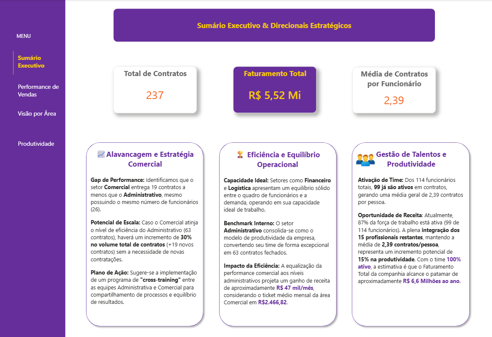
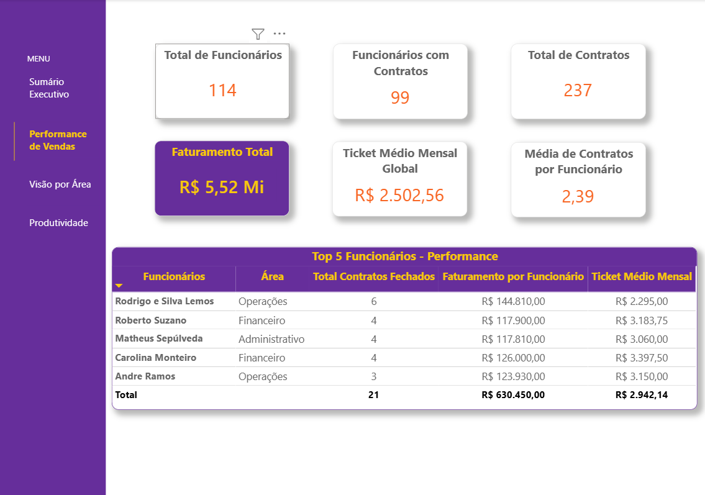
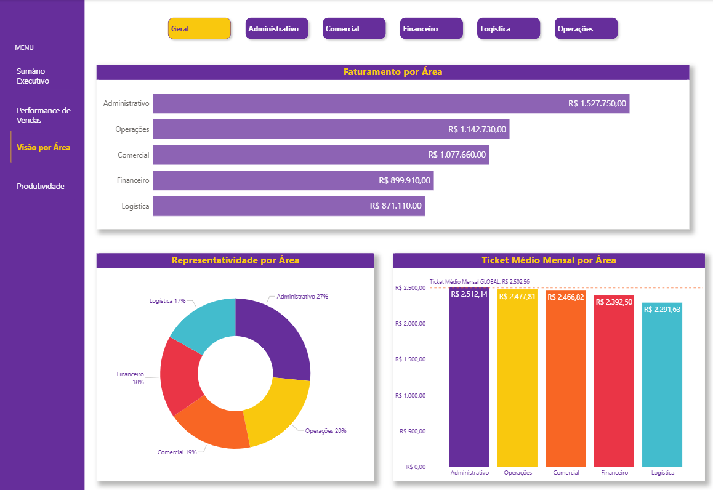
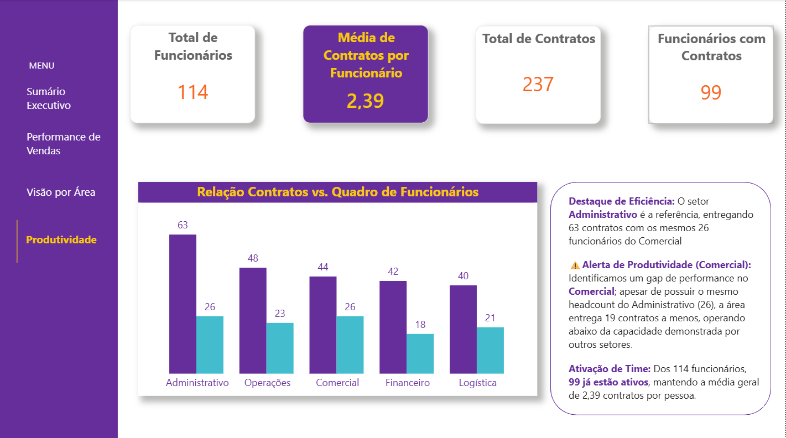

# 📊 Multi-Factor Performance Dashboard | Dashboard de Performance Multifatorial 

> **Note:** This project was originally developed in Portuguese. You can find the full English documentation below, followed by the original Portuguese version.

[English Version](#english-version) | [Versão em Português](#versão-em-português)

---

## English Version 

### 📋 Project Overview
This project delivers an **end-to-end data analysis solution**, combining Python’s processing power with Power BI’s visual excellence. The architecture follows UX Design principles and the Inverted Pyramid logic, where the Executive Summary serves as the strategic starting point, followed by technical detailing.

### 🏗️ Methodology & Data Governance
A key differentiator of this project was the Data Reconciliation and Auditing phase:

* **Referential Integrity**: The total revenue was validated through cross-checking between Python and Power BI, showing full convergence of values (R$ 5.52M). This consistency confirms the accuracy of the data merging process and the correct application of business rules across both tools.
* **💡Validation Strategy**: Data cleaning was performed on two fronts: **Python** for initial auditing and type casting, and **Power Query** to ensure the dashboard's self-sufficiency through double-check validation.
* **Scalability & Flexibility**: Utilizing `.merge(how='left')` and `.groupby().size()` in Python ensured zero data loss during the ETL phase, allowing a holistic view of the raw data before applying business rules.

### 📈 Dashboard Insights

#### 1. Executive Summary & Strategic Direction
The "Home" of the project focuses on actionable insights.

* **Key Finding**: Integrating the remaining 15 professionals could scale annual revenue from R$ 5.5M to R$ 6.6M.

#### 2. Sales Performance
Detailed view of Top Performers and Global KPIs.
* **Talent Benchmark**: The Operations sector stands out for housing the employee with the largest active portfolio (6 contracts), serving as a model for the suggested cross-training program.

#### 3. Area View & Productivity
Comparative analysis of Average Ticket and the Ratio of Contracts vs. Headcount.

### 🛠️  Technologies & Data Origin

* **Data Sources**: Integration of multiple datasets in `.csv` (Employees and Customers) and `.xlsx` (Services Provided) formats.
* **Python (Pandas & Matplotlib)**: Performed the ETL process, handled distinct data types, and conducted exploratory data analysis (EDA) for hypothesis validation.
* **Power BI**: Developed relational modeling, DAX measures, and interactive dashboard design.

> **Note**: A "Laboratory" tab was kept as a hidden page in the `.pbix` file for technical validation and future metric expansions.

---

## Versão em Português 

# 📊 Dashboard de Performance Multifatorial (Python & Power BI)

### 📋 Sobre o Projeto
Este projeto representa uma **análise end-to-end**, unindo o poder de processamento do Python com a excelência visual do Power BI. A estrutura foi desenhada seguindo princípios de UX Design e a lógica da Pirâmide Invertida, onde o Sumário Executivo atua como o ponto de partida estratégico, seguido pelo detalhamento técnico.

### 🏗️ Metodologia e Governança de Dados

Um diferencial deste projeto foi a fase de Conciliação e Auditoria de Dados:

* **Integridade Referencial**: O faturamento total foi validado através de dupla checagem entre Python e Power BI, apresentando total convergência nos valores (R$ 5,52M). Essa consistência confirma a precisão do cruzamento das bases e a correta aplicação das regras de negócio em ambas as ferramentas.

* **💡 Estratégia de Validação**: Neste projeto, realizei o tratamento de dados em duas frentes: utilizei **Python** para uma auditoria inicial e tratamento de tipos, e repliquei a lógica no **Power Query** para garantir que o Dashboard fosse autossuficiente e validado por dupla checagem.

* **Scalability & Flexibilidade**: O uso de `.merge(how='left')` e `.groupby().size()` em Python garantiu que nenhum registro fosse perdido durante a fase de ETL, permitindo uma visão holística da base bruta antes da aplicação das regras de negócio no BI.

### 📈 Visualização do Dashboard

#### 1. Sumário Executivo & Direcionais Estratégicos
A "Home" do projeto foca em insights acionáveis.

* **Insight**: Identifiquei que a plena integração dos 15 profissionais restantes pode elevar o faturamento anual de R$ 5,5 Milhões para R$ 6,6 Milhões.

#### 2. Performance de Vendas
Visão detalhada dos Top Performers e KPIs Globais.

* **Benchmark de Talento**: O setor de Operações destaca-se por abrigar o colaborador com maior carteira ativa (6 contratos), servindo de modelo para o programa de cross-training sugerido.

#### 3. Visão por Área & Produtividade
Gráficos comparativos de Ticket Médio e relação Contratos vs. Quadro de Funcionários.

 

### 🛠️ Tecnologias e Origem dos Dados

* **Fontes de Dados**: Integração de múltiplos datasets em formatos `.csv` (Base de Funcionários e Clientes) e `.xlsx` (Base de Serviços Prestados).

* **Python (Pandas & Matplotlib)**: Realizei o processo de ETL, o tratamento de tipos de dados distintos e a análise visual exploratória para validação de hipóteses.

* **Power BI**: Desenvolvi a modelagem relacional, a criação de medidas em DAX e o design dos dashboards interativos.

> **Obs**: A aba Laboratório foi mantida como página oculta no arquivo '.pbix' para fins de validação técnica e futuras expansões de métricas.)
